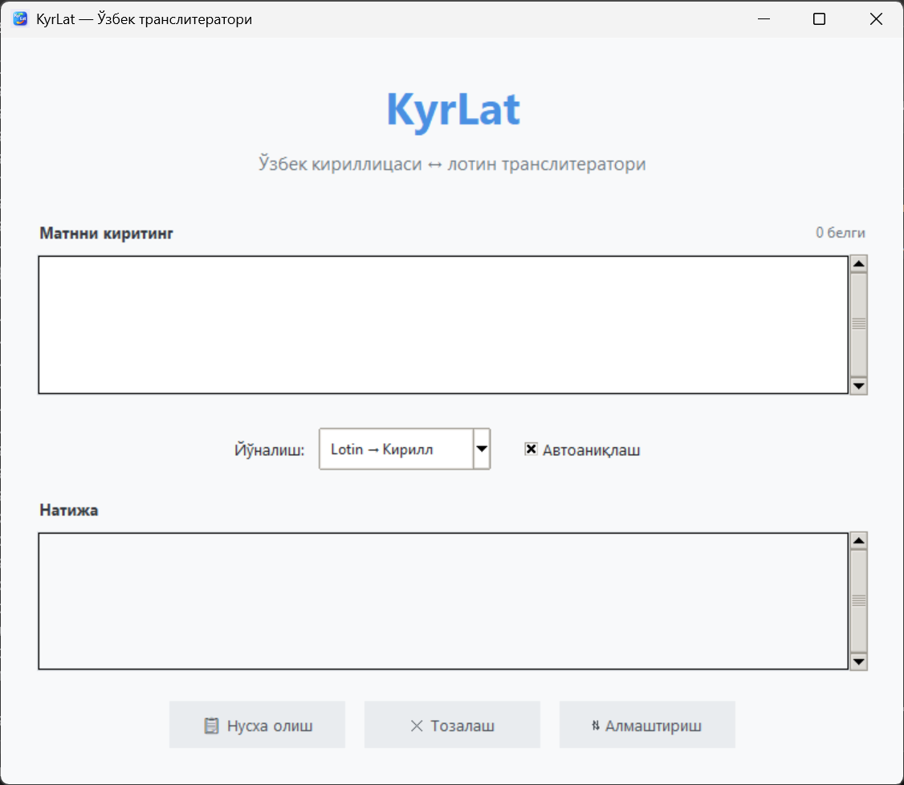

# KyrLat — Ўзбек Транслитератори

<div align="center">
  
  
  **Simple and reliable Uzbek script converter**
  
  [](LICENSE)
  [](https://www.python.org/downloads/)
  
</div>

## 🌟 About

KyrLat is a lightweight desktop application that converts text between Uzbek Cyrillic and Latin scripts. 

I created this tool for my parents — both Uzbek language teachers (my father is a professor of Uzbek philology) — who frequently work with documents in Uzbek. Switching between keyboards and scripts was tedious, so I built this simple converter to make their work easier.

**Key Features:**
- ✨ **Live transliteration** — converts text as you type
- 🔍 **Automatic script detection** — intelligently detects Cyrillic or Latin
- 📝 **Character counter** — real-time character count
- 🔄 **Bidirectional conversion** — Cyrillic ↔ Latin
- 💾 **Copy to clipboard** — one-click copying
- 🎨 **Clean, modern interface** — simple and distraction-free

---

## 📸 Screenshot



---

## 🚀 Quick Start

### Option 1: Download Executable (Windows)

1. Download `KyrLat.exe` from [Releases](../../releases)
2. Double-click to run — no installation needed!

### Option 2: Run from Source

**Requirements:**
- Python 3.7 or higher
- tkinter (usually included with Python)

**Installation:**

```bash
# Clone the repository
git clone https://github.com/yourusername/KyrLat.git
cd KyrLat

# Run the application
python main.py
```

---

## 🎯 Usage

1. **Type or paste** Uzbek text into the input area
2. The app **automatically detects** whether it's Cyrillic or Latin
3. **Transliterated text** appears instantly in the output area
4. Click **📋 Copy** to copy the result to clipboard

**Manual Controls:**
- **Direction selector** — manually choose Cyrillic → Latin or Latin → Cyrillic
- **Auto-detect toggle** — enable/disable automatic script detection
- **⇅ Swap** — move output to input and reverse direction
- **✕ Clear** — clear both input and output

---

## 🔤 Transliteration Rules

KyrLat uses the **official Uzbek Latin alphabet** (1995 standard) with proper apostrophe handling.

### Latin → Cyrillic

| Latin | Cyrillic | Latin | Cyrillic |
|-------|----------|-------|----------|
| A, a  | А, а     | Oʻ, oʻ | Ў, ў    |
| B, b  | Б, б     | P, p   | П, п    |
| D, d  | Д, д     | Q, q   | Қ, қ    |
| E, e  | Е, е     | R, r   | Р, р    |
| F, f  | Ф, ф     | S, s   | С, с    |
| G, g  | Г, г     | T, t   | Т, т    |
| Gʻ, gʻ | Ғ, ғ    | U, u   | У, у    |
| H, h  | Ҳ, ҳ     | V, v   | В, в    |
| I, i  | И, и     | X, x   | Х, х    |
| J, j  | Ж, ж     | Y, y   | Й, й    |
| K, k  | К, к     | Z, z   | З, з    |
| L, l  | Л, л     | Sh, sh | Ш, ш    |
| M, m  | М, м     | Ch, ch | Ч, ч    |
| N, n  | Н, н     | Ng, ng | Нг, нг  |
| O, o  | О, о     | Yo, yo | Ё, ё    |
| — | — | Yu, yu | Ю, ю    |
| — | — | Ya, ya | Я, я    |

### Apostrophe Normalization

The app automatically normalizes all apostrophe variants to the standard Uzbek apostrophe (ʻ U+02BB):
- `'` (ASCII apostrophe)
- `` ` `` (grave accent)
- `ʼ` (modifier letter apostrophe)
- `'` (right single quotation mark)

### Apostrophe Usage in Transliteration

The apostrophe has **two different functions** in Uzbek Latin script:

#### 1. Part of letters (Gʻ, Oʻ)
Used to form special letters:
- `Gʻ, gʻ` → `Ғ, ғ`
- `Oʻ, oʻ` → `Ў, ў`

**Example:** `oʻzbek` → `ўзбек`

#### 2. Digraph Separator (Is'hoq pattern)
Prevents incorrect digraph conversion:
- `Is'hoq` → `Исҳоқ` (not `Ишоқ`) — apostrophe prevents `sh`
- `As'har` → `Асҳар` (not `Ашар`)
- Works with endings: `Is'hoqjon` → `Исҳоқжон`

#### 3. Hard Sign - Tutuq belgisi (ra'no pattern)
Becomes the Cyrillic hard sign (ъ):
- `ra'no` → `раъно`
- `ma'no` → `маъно`
- `ma'lum` → `маълум`

The system automatically determines which function based on context.

---

## 🛠️ Technical Details

**Built with:**
- **Python 3.x** — core logic
- **Tkinter** — GUI framework
- **PyInstaller** — executable packaging

**Architecture:**
- `main.py` — GUI and user interface
- `transliterate.py` — transliteration logic and mapping tables
- `icon.ico` — application icon

**No external dependencies** — just Python standard library!

---

## 📦 Building from Source

To create a standalone executable:

```bash
# Install PyInstaller
pip install pyinstaller

# Build executable
pyinstaller --onefile --windowed --icon=icon.ico --name=KyrLat main.py

# Find the executable in dist/KyrLat.exe
```

---

## 🤝 Contributing

Contributions are welcome! Feel free to:
- Report bugs
- Suggest features
- Submit pull requests

---

## 📄 License

This project is licensed under the MIT License - see the [LICENSE](LICENSE) file for details.

---

## 👨‍👩‍👦 Dedication

This project is dedicated to my parents, who have devoted their lives to teaching and preserving the Uzbek language.

*Ота-онамга бағишланади. Сизларнинг меҳнатингиз ҳеч қачон унутилмайди.*

---

## 📧 Contact

Created by [@cringepnh](https://github.com/cringepnh)

If you find this tool helpful, please ⭐ star the repository!
